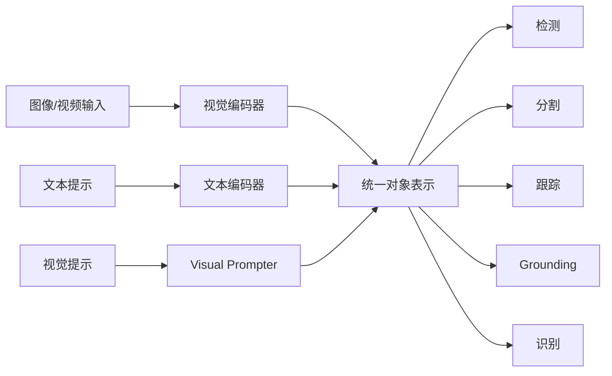

# GLEE 论文简介与解读

- 原论文 PDF：[`GLEE.pdf`](./GLEE.pdf)

## 1. 一句话结论
GLEE 把检测、分割、跟踪、grounding、识别等对象级任务统一进同一框架，目标是做“开放世界对象理解”的通用底座。

## 2. 论文要解决什么问题
传统视觉系统通常是“一个任务一个模型”，导致：
- 训练/部署成本高；
- 跨任务迁移弱；
- 对开放类别泛化能力不足。

GLEE 的核心问题是：能否用统一对象表示，覆盖多任务并保持可迁移性。

## 3. 方法逻辑（流程图）

## 4. 关键创新点
1. **统一建模**：同一框架支持多类对象任务。  
2. **多模态提示协同**：文本和视觉提示共同约束目标对象。  
3. **多源监督融合**：融合不同标注粒度的数据，增强泛化。

## 5. 实验结果应关注什么
- 多任务是否同时提升（而非单项最优）；
- 零样本迁移表现（新数据/新任务）；
- 与单任务 SOTA 的性能差距与性价比。

## 6. 优势与局限
**优势**：统一范式清晰、迁移潜力大、任务扩展性好。  
**局限**：统一模型通常训练复杂，对数据配比和训练策略较敏感。

## 7. 落地建议
- 适合做“多任务视觉中台”；
- 先从“检测+grounding”子集验证，再扩展分割与跟踪。
