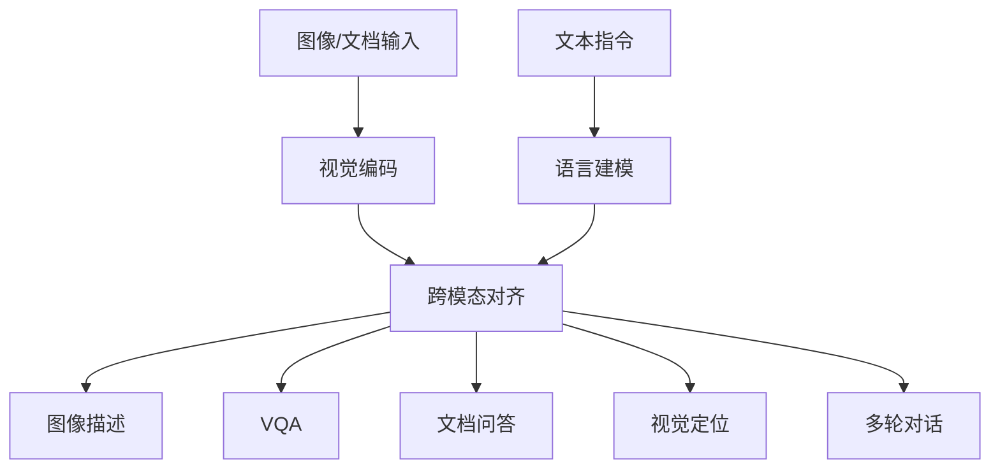

# Qwen-VL 论文简介与解读

- 原论文 PDF：[`qwen-vl.pdf`](./qwen-vl.pdf)

## 1. 一句话结论
Qwen-VL 强调通用图文理解与多轮交互能力，适合作为多模态应用的基础模型之一。

## 2. 论文要解决什么问题
很多 LVLM 在基准上强，但交互性和综合能力不均衡。Qwen-VL 关注“可用性 + 多任务覆盖”。

## 3. 能力结构图

## 4. 关键创新点
1. **通用 + 对话双版本**（Qwen-VL / Qwen-VL-Chat）。  
2. **任务覆盖广**：caption、VQA、doc-VQA、grounding。  
3. **强调交互体验**：更贴近真实应用场景。

## 5. 评测重点
- 多任务的整体平衡性；
- 中文/多语场景可用性；
- 多轮对话下的一致性与稳定性。

## 6. 优势与局限
**优势**：综合能力均衡，工程落地门槛低。  
**局限**：复杂长链推理和细粒度定位仍依赖任务设计与提示词质量。

## 7. 落地建议
- 可作为图文助手、知识库问答、文档理解的默认基线；
- 建议配套检索与工具调用，提升稳定性。
