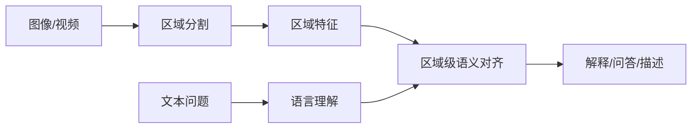

# PAM 论文简介与解读

- 原论文 PDF：[`PAM.pdf`](./PAM.pdf)

## 1. 一句话结论
PAM 尝试在 SAM2 的区域能力上融合语言模型，让“分割结果”可被语义理解和解释。

## 2. 问题定义
仅有 mask 不够，真实业务需要“区域是什么、为什么、如何交互”。

## 3. 能力链路

## 4. 关键价值
- 把分割扩展为“区域级理解”；
- 提升解释性与交互性；
- 对复杂视觉任务更友好。

## 5. 落地建议
适合“看图问答、智能巡检、区域级报告生成”等场景。
