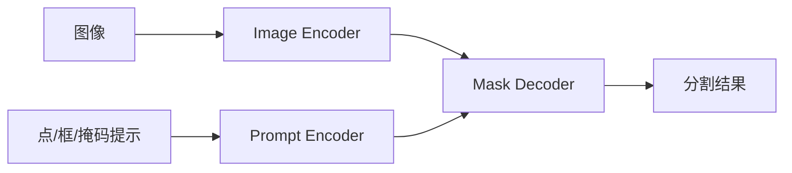

# SAM 论文简介与解读

- 原论文 PDF：[`SAM.pdf`](./SAM.pdf)

## 1. 一句话结论
SAM 通过“可提示分割 + 超大规模 SA-1B 数据”建立了通用分割基础模型。

## 2. 问题定义
分割模型往往依赖特定任务训练，泛化差。SAM 目标是让分割像基础能力一样“可迁移、可提示”。

## 3. 方法框架

## 4. 关键贡献
1. Segment Anything 任务定义。  
2. SA-1B 超大规模分割数据。  
3. 零样本迁移能力强，工程适配广。

## 5. 实验看点
- 零样本分割效果；
- 不同提示类型下的稳定性；
- 跨数据集泛化能力。

## 6. 落地建议
适合作为自动标注、前景提取、候选区域生成模块。
