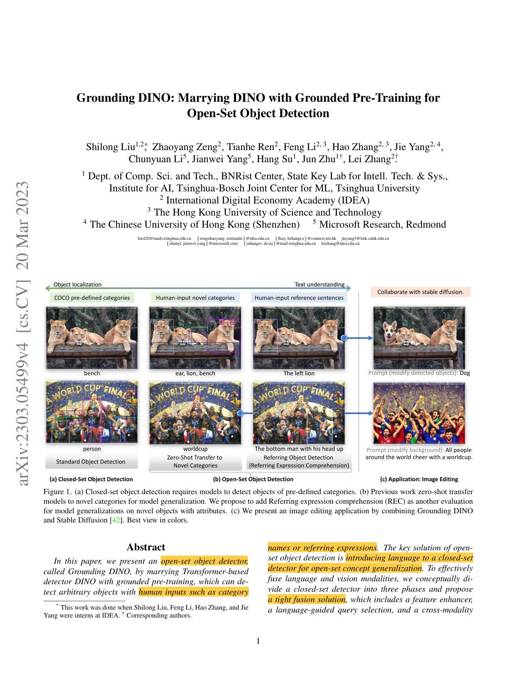
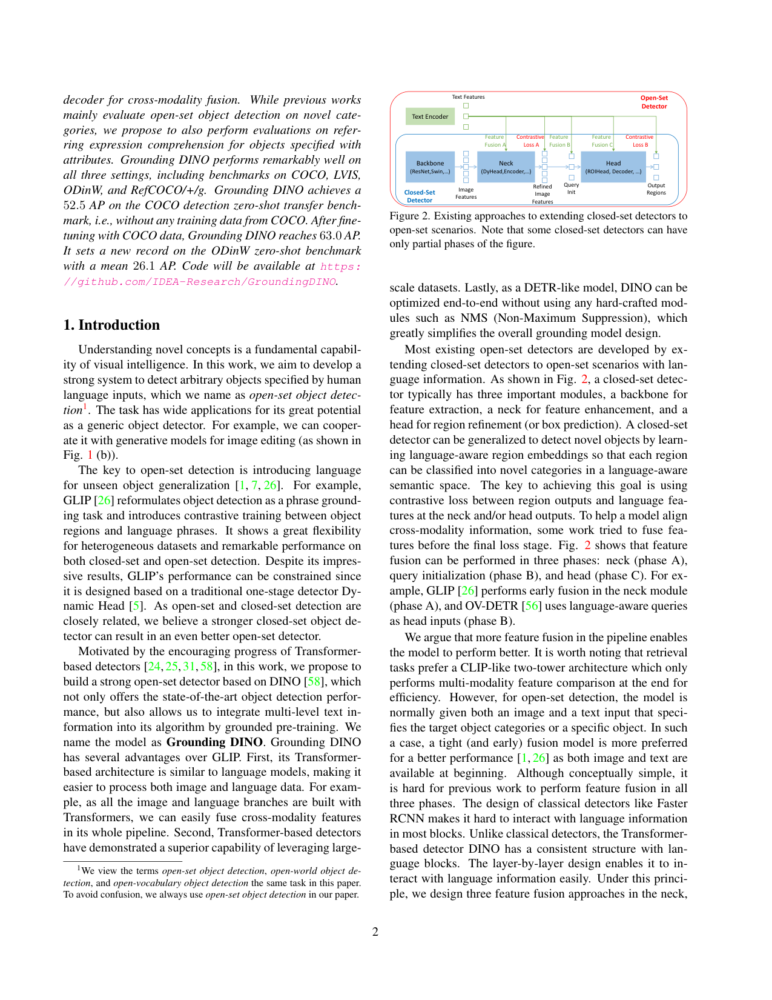
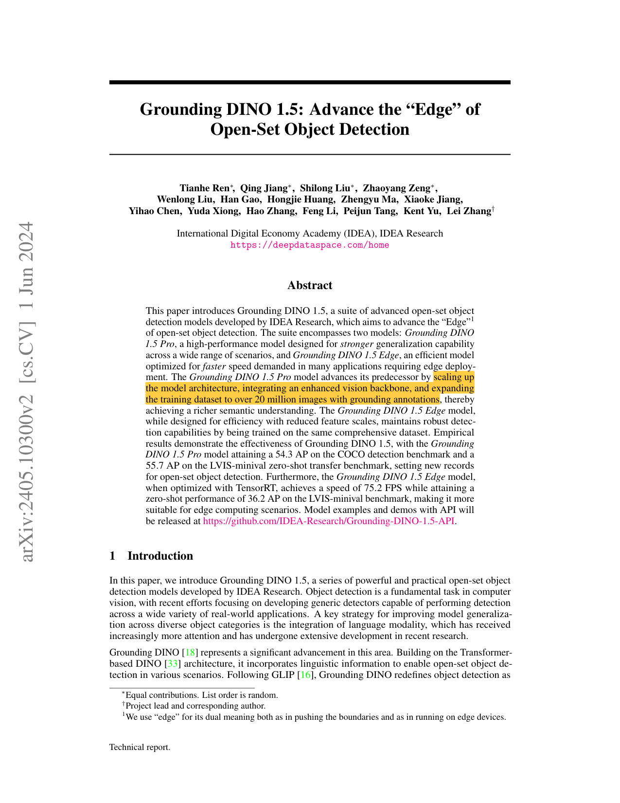
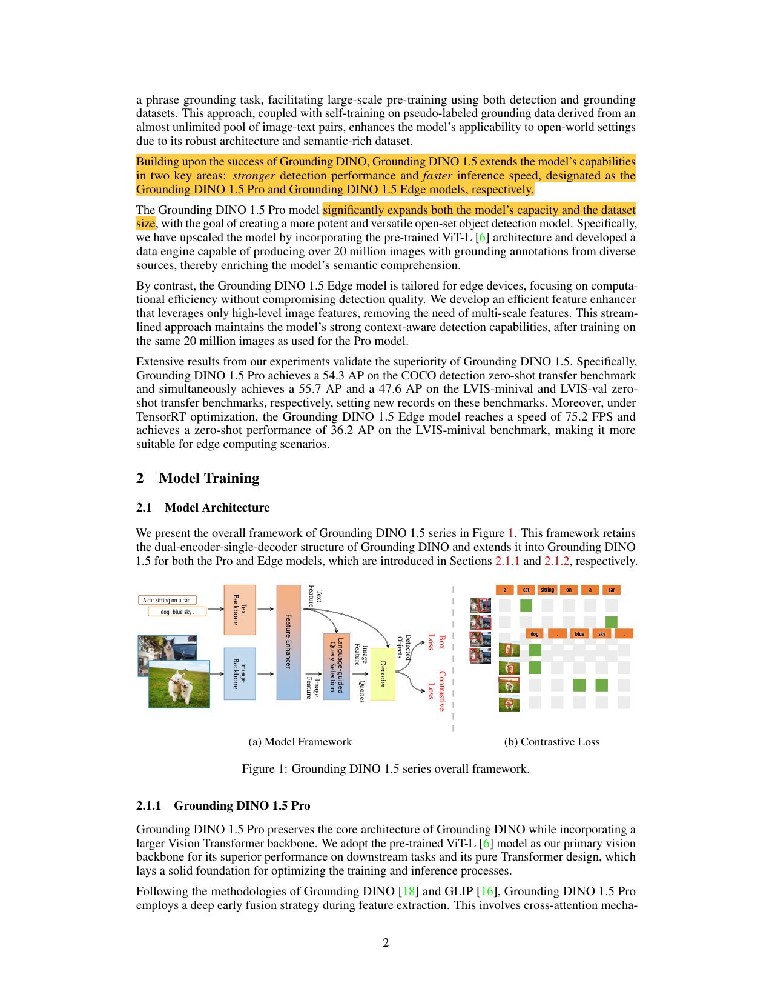

# 📚 Week_04 论文精选

## [g-dino](g-dino.pdf)

**📝 摘要**：

> In this paper, we present an open-set object detector,
called Grounding DINO, by marrying Transformer-based
detector DINO with grounded pre-training, which can de-
tect arbitrary objects with human inputs such as category
* This work was done when Shilong Liu, Feng Li, Hao Zhang, and Jie

<table><tr>
  <td></td>
  <td></td>
</tr></table>

## [g-dino1.5](g-dino1.5.pdf)

**📝 摘要**：

> This paper introduces Grounding DINO 1.5, a suite of advanced open-set object
detection models developed by IDEA Research, which aims to advance the “Edge”1
of open-set object detection. The suite encompasses two models: Grounding DINO
1.5 Pro, a high-performance model designed for stronger generalization capability
across a wide range of scenarios, and Grounding DINO 1.5 Edge, an efficient model
optimized for faster speed demanded in many applications requiring edge deploy-
ment. The Grounding DINO 1.5 Pro model advances its predecessor by scaling up
the model architecture, integrating an enhanced vision backbone, and expanding
the training dataset to over 20 million images with grounding annotations, thereby
achieving a richer semantic understanding. The Grounding DINO 1.5 Edge model,
while designed for efficiency with reduced feature scales, maintains robust detec-
tion capabilities by being trained on the same comprehensive dataset. Empirical
results demonstrate the effectiveness o

<table><tr>
  <td></td>
  <td></td>
</tr></table>

