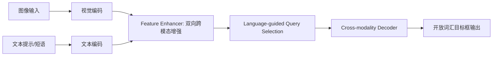

# Grounding DINO 论文简介与深度解读

- 原论文 PDF：[`g-dino.pdf`](./g-dino.pdf)

## 0) 论文定位
Grounding DINO 的关键价值不是“再做一个检测器”，而是把检测任务改写成**可由文本指定目标的开放词汇检测**：
- 输入不再局限固定类别表；
- 可以用类别词、短语、指代表达直接指定目标；
- 同时兼顾 closed-set 与 open-set 场景。

---

## 1) 研究问题（Problem Statement）
作者要解决的核心矛盾：

1. 传统检测器依赖固定类别表，遇到新类别泛化弱；
2. 纯“后期对齐”的视觉-语言方案，跨模态融合深度不足；
3. 开放检测不仅要“识别类别”，还要能处理带属性/关系的表达（如 referring expression）。

Grounding DINO 的路线是：
**以 DINO 为强检测底座，在 backbone/neck/head 三个阶段更紧密地融合语言信息。**

---

## 2) 方法总览（从输入到输出）

三段式融合对应论文最关键设计：
- **Feature Enhancer**：在特征增强阶段就做跨模态交互；
- **Language-guided Query Selection**：用语言引导 query 初始化；
- **Cross-modality Decoder**：在解码阶段继续做图文交互，强化最终定位与判别。

这比“只在最后做对比损失”的 late-fusion 路线更激进。

---

## 3) 关键创新拆解（为什么它有效）

### 3.1 三阶段紧耦合融合
- 不是把语言当“外挂标签”，而是让语言影响 query 与解码过程本身；
- 对目标短语中属性词（颜色、位置、关系）更友好。

### 3.2 任务定义外扩
论文强调不仅评估 novel categories，还纳入 referring expression 场景，这让“开放检测”更贴近真实检索与交互任务。

### 3.3 继承 DINO 的检测强基线
Grounding DINO 并非从零重做，而是站在 DINO 的训练稳定性和检测能力上做跨模态扩展，工程上更可复用。

---

## 4) 实验结果怎么读（重点不是背数字）
论文给出的关键信号是：

1. **零样本迁移能力强**：在 COCO 零样本迁移设置下达到高水平 AP；
2. **开放基准表现稳**：在 ODinW、LVIS 等开放检测基准上有竞争力；
3. **RefCOCO 系列可用**：说明它不仅能“类目级检测”，还能处理更细的语言定位。

> 解读重点：Grounding DINO 的意义在“统一开放检测 + 指代表达定位”，而不只是某个单一榜单数字。

---

## 5) 与相关路线的差异

### 对比 GLIP（代表性 grounding 路线）
- GLIP 强在把检测重写为 grounding 任务；
- Grounding DINO 更强调基于 Transformer 检测器的全链路跨模态融合；
- 实践中 Grounding DINO 在“检测器范式 + 开放词汇能力”之间做了更均衡的取舍。

### 对比 closed-set 检测器
- closed-set：类别表固定，扩类成本高；
- Grounding DINO：类别开放，文本即可扩类。

---

## 6) 局限与风险（读论文必须看这一节）

1. **提示词敏感性**：同义词、短语粒度、上下文都会影响检出结果；
2. **误检与幻觉**：开放词汇设定下，召回提升常伴随误检风险；
3. **长尾细粒度区分难**：外观近似类别仍可能混淆；
4. **实时性成本**：在高分辨率/长文本提示下，推理开销不可忽视。

---

## 7) 复现与落地清单（实操视角）

### 7.1 最小可复现路径
- 固定提示词模板（先名词短语，再补属性词）；
- 统一置信度阈值和 NMS/后处理策略；
- 在同一数据切分上对比基线（closed-set 检测器 vs Grounding DINO）。

### 7.2 业务落地建议
- 把它作为“开放类目候选框生成器”；
- 下游叠加任务规则（分类复核、跟踪、OCR、属性识别）；
- 对高风险场景引入二次确认，避免开放词汇误检直接触发自动决策。

---

## 8) 一页结论（给决策者）
Grounding DINO 的价值是把检测能力从“固定标签体系”推进到“文本可编程目标检测”。
如果你的场景类别经常变化、标注难以穷尽、需要人机交互指定目标，它是值得优先评估的底座模型。
