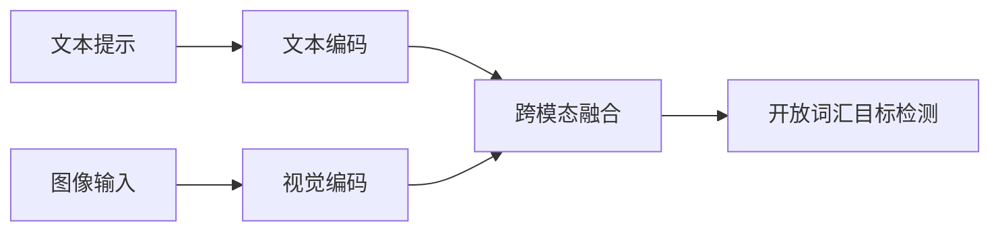

# Grounding DINO 论文简介与解读

- 原论文 PDF：[`g-dino.pdf`](./g-dino.pdf)

## 1. 一句话结论
Grounding DINO 把开放词汇检测与文本 grounding 深度融合，实现“文本驱动的开放检测”。

## 2. 方法框架

## 3. 关键意义
- 不依赖固定类别表；
- 长尾类别泛化强；
- 与检索、问答、机器人任务结合自然。

## 4. 落地建议
适合类别经常变化、标签难穷举的场景。
