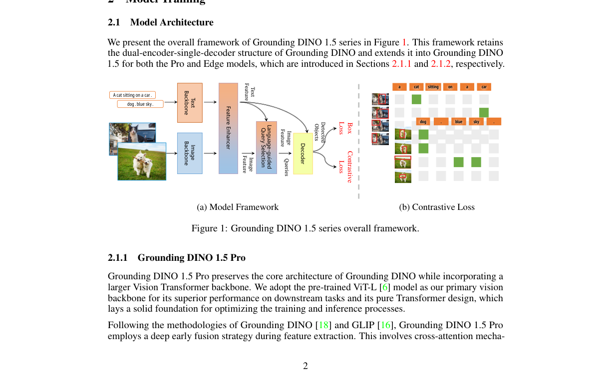
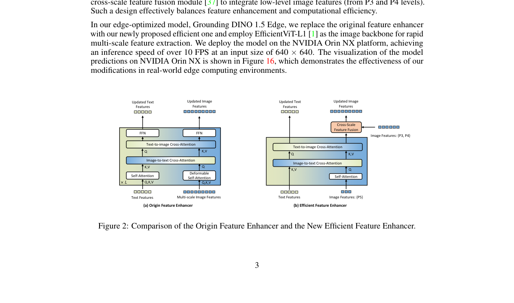

# Grounding DINO 1.5 论文简介

**论文团队**  
IDEA Research 团队  
主要作者：Tianhe Ren、Qing Jiang、Shilong Liu、Zhaoyang Zeng 等  
项目负责人：Lei Zhang

原论文：[`g-dino1.5.pdf`](./g-dino1.5.pdf)

---

## 先说结论
这篇论文最有价值的地方，不是单纯把分数再刷高一点，而是把路线明确拆成两条：

- 一条追求上限，叫 Pro
- 一条追求部署效率，叫 Edge

这让它从一篇模型论文，变成了一套可以直接做工程选型的方案。

---

## 第一部分：客观总结

### 1. 论文想解决什么
作者盯住的是开放词汇检测里的两个现实问题：

1. 精度还可以继续提高，尤其是复杂场景和长尾类别
2. 线上部署很吃算力，很多设备跑不动

所以 Grounding DINO 1.5 的目标很直接：
同一条技术路线，同时给出高精度版本和高效率版本。

### 2. 整体结构
下面这张是论文里的总框架图。

图里最关键的是这条主链路：
图像特征和文本特征先融合，再进行语言引导的查询选择，最后由解码器输出检测框。

你可以把它理解成一句话：
模型不是先看图再硬对类别，而是让文本从前到后都参与了检测过程。

### 3. 论文的关键创新

#### 创新一：明确区分 Pro 和 Edge 两个版本
- Pro 版本：扩大模型和数据规模，冲击精度上限
- Edge 版本：压缩高成本模块，优先保证速度和部署可行性

这一步很关键，因为它把研究模型和工程模型之间的落差缩小了。

#### 创新二：高效特征增强器
论文给了对比图，直接展示了新旧结构差异。

从图里可以看到，Edge 版本把计算重点放在高层语义特征上，减少重计算模块，再通过跨尺度融合补回一部分细节能力。

这就是它能把速度拉起来的核心原因。

#### 创新三：训练策略上的取舍更明确
作者讨论了一个很实际的问题：
融合做得越早，召回通常越高，但误检风险也会增大。

这篇论文的处理方式是保留早期融合带来的收益，再通过采样策略去压误检。
这不是“新模块堆叠”，而是很工程化的平衡。

### 4. 关键结果
论文报告的关键数字包括：

- Pro 在 COCO 上达到 54.3 AP
- Pro 在 LVIS-minival 零样本迁移上达到 55.7 AP
- Edge 在 TensorRT 优化下达到 75.2 FPS
- Edge 在 LVIS-minival 零样本迁移上达到 36.2 AP

这里真正值得关注的是组合关系：
Pro 负责上限，Edge 负责可部署速度，两者共同覆盖了大多数真实业务场景。

### 5. 这篇论文的边界
按论文内容和结果来看，仍有几个边界要注意：

- 提示词质量会直接影响结果
- 开放词汇检测天然存在误检风险
- Edge 在特别复杂场景下通常不如 Pro 稳定

这些都不是缺点，而是使用这类模型时必须提前接受的现实。

---

## 第二部分：我的建议
上面是客观内容。下面是我给你的主观建议。

1. 先上 Edge，把线上吞吐和时延打通
2. 再用 Pro 做关键场景复核，形成双层方案
3. 建立提示词模板库，不要每次临时写
4. 用误检成本来调阈值，不要只盯 AP
5. 每周沉淀失败样本，持续迭代提示词和后处理

如果你的目标是长期稳定运营，这篇论文给你的最大启发就是：
别追一个万能版本，而是把高精度和高效率分层使用。