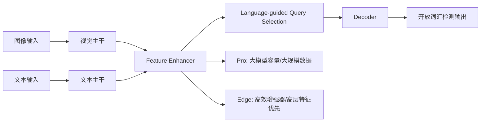

# Grounding DINO 1.5 论文简介与深度解读

- 原论文 PDF：[`g-dino1.5.pdf`](./g-dino1.5.pdf)

## 0) 论文定位
Grounding DINO 1.5 的核心不只是“更高指标”，而是明确给出两条产品化路线：
- **Pro**：追求泛化与精度上限；
- **Edge**：面向部署速度与边缘算力约束。

这使它从“研究模型”进一步走向“可选型的工程模型家族”。

---

## 1) 研究目标
相较前代，作者主要回答两个问题：

1. 能否在开放检测上继续提升泛化与上限性能？
2. 能否在保持开放能力的同时，把推理速度做到可边缘部署？

对应策略：
- Pro：放大模型与数据规模；
- Edge：重构高效特征增强路径，减少计算负担。

---

## 2) 方法框架（统一骨架 + 双分支）

整体仍是双编码器 + 单解码器范式，但 Pro 与 Edge 在效率-性能权衡点上分化明显。

---

## 3) 关键技术点

### 3.1 Pro 路线：扩容与语义覆盖
- 更强视觉主干（文中强调更大规模 ViT 路线）；
- 训练数据扩展到千万级 grounding 标注规模；
- 目标是提升复杂场景、长尾类别与跨域泛化能力。

### 3.2 Edge 路线：压缩跨模态计算成本
- 重点使用高层语义特征进行融合；
- 减少多尺度重计算和重型增强模块开销；
- 配合 TensorRT 等推理优化，面向实时场景。

### 3.3 训练策略上的平衡
论文讨论了 early fusion 与 late fusion 的取舍：
- early fusion：召回和定位通常更好，但更容易出现幻觉；
- late fusion：鲁棒些，但可能降低召回。

1.5 的思路是保留 early fusion 优势，同时通过采样策略（尤其负样本比例）来抑制副作用。

---

## 4) 实验结果解读（如何正确看）
文中给出的信号非常清晰：

1. **Pro** 在开放检测基准上继续刷新上限；
2. **Edge** 在速度与精度之间取得可部署平衡；
3. 同时给出了“高性能”和“高效率”两条可直接选型的路线。

> 关键解读：1.5 的贡献是把“开放检测能力”与“部署场景差异”显式产品化，而不只是单模型刷榜。

---

## 5) 与前代/同类方法差异

### 相比 Grounding DINO
- 前代强调范式成立；
- 1.5 更强调规模化训练与工程可部署性，形成 Pro/Edge 双版本。

### 相比单一路线模型
- 单一路线常在一个点最优（只快或只准）；
- 1.5 提供可切换策略，更适合真实业务中的多场景需求。

---

## 6) 局限与使用边界

1. 提示词工程仍然关键，坏提示会显著拉低效果；
2. 开放检测固有误检风险仍存在；
3. Edge 版在极端小目标/复杂遮挡场景可能弱于 Pro；
4. 跨域部署仍需做场景校准（阈值、文本模板、后处理规则）。

---

## 7) 落地建议（选型与实施）

### 7.1 选型原则
- **离线高质量分析 / 算力充足**：优先 Pro；
- **在线低时延 / 边缘设备**：优先 Edge；
- **混合系统**：Edge 先粗筛，Pro 做复核。

### 7.2 实施步骤
1. 先建立提示词模板库（类别词、属性词、否定词）；
2. 在业务数据上标定阈值与误检成本；
3. 监控“召回-误检”曲线，按业务风险动态调参；
4. 对关键链路加入二次验证模块。

---

## 8) 一页结论（给决策者）
Grounding DINO 1.5 的价值在于：
- 在开放词汇检测上继续抬高上限（Pro）；
- 同时给出可实时部署的工程版本（Edge）。

它不是简单迭代，而是把“开放检测能力”做成了可按场景落地的双路线方案。
