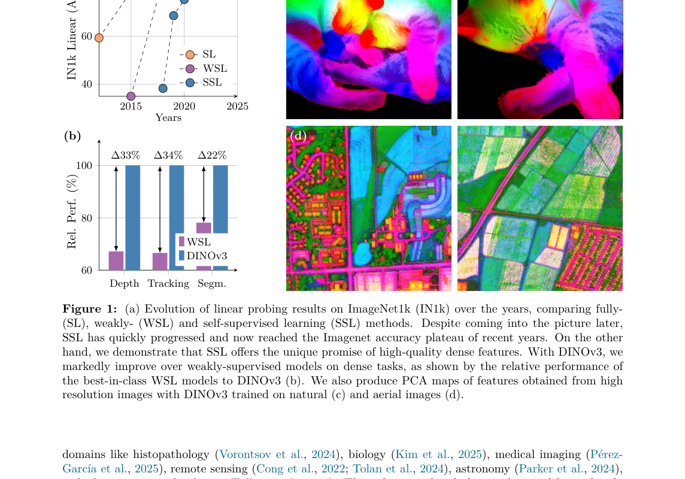
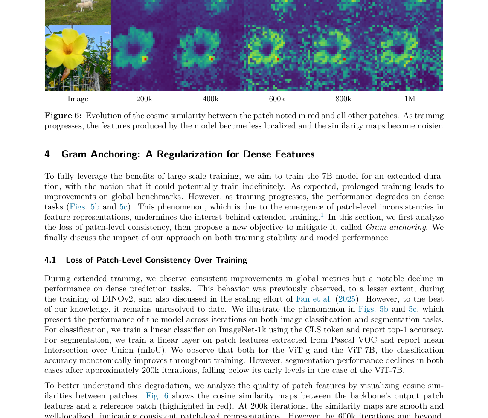
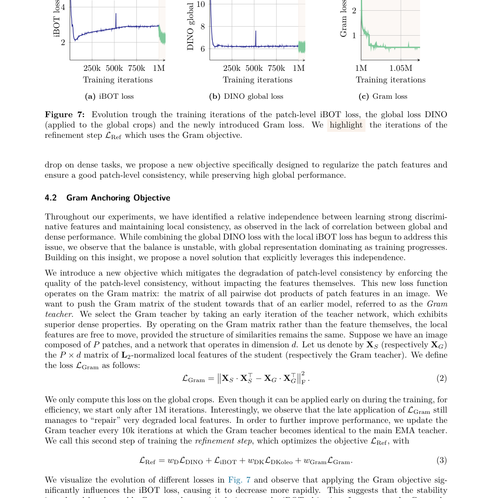
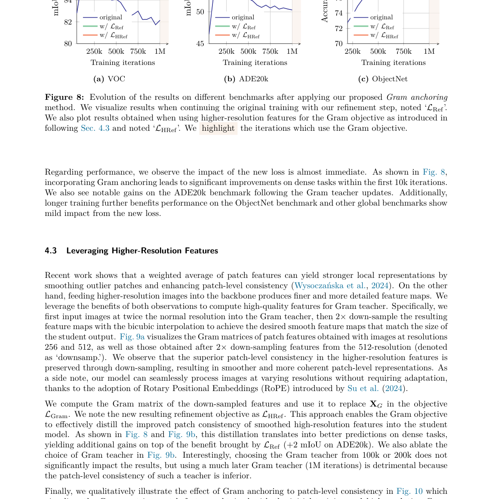
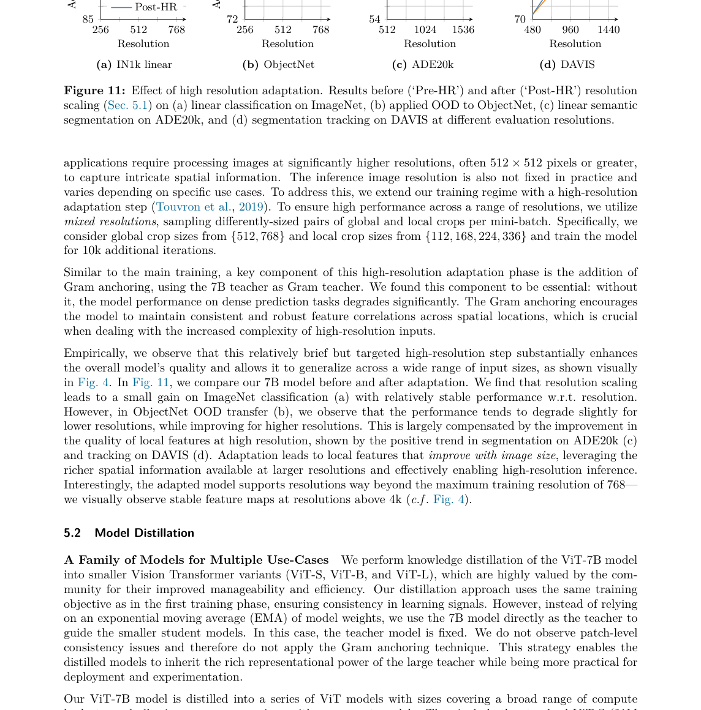

# DINOv3 论文简介

**论文团队**  
Meta AI Research，主要作者包括 Oriane Siméoni、Huy V. Vo、Maximilian Seitzer、Federico Baldassarre、Maxime Oquab 等。  
原论文：[`DINOv3.pdf`](./DINOv3.pdf)

---

## 1. 主要内容

DINOv3 是一篇大规模自监督视觉预训练工作，核心目标是把“单一冻结视觉 backbone”做成通用编码器，覆盖分类、分割、深度、跟踪、匹配等多类任务。

论文主要做了四组技术改动：

1. 更大规模的数据与模型训练配方
2. 解决长训练中 dense 特征退化的问题
3. 训练后阶段做高分辨率适配与文本对齐
4. 用多学生蒸馏把 7B 级教师能力下放到中小模型

---

## 2. 核心结构

这张图给了论文的核心定位：

- 自监督线性探针在 ImageNet 已接近弱监督/监督高位
- 在 dense 任务上，DINOv3 相比弱监督路线有明显优势
- 高分辨率输入下的特征图保持较好语义结构

这决定了 DINOv3 的技术重心不再是“再加一个 pretext task”，而是把训练稳定性和 dense 质量拉高。

---

## 3. 关键技术拆解

### 3.1 训练规模与配方

论文沿用 DINOv2 的教师-学生范式，但把数据准备、训练长度、优化细节做了系统升级。

文中强调三点：

- 数据构建从“能收集到”转向“有效样本密度”
- 大模型长周期训练时，常规余弦策略会遇到后期退化
- 随模型规模增大，patch 级别局部性更容易丢失

### 3.2 Gram Anchoring

这组图展示了长训练后 patch 相似度图的局部性下降：
同一个锚点 patch 与整图越来越相似，边界逐步变糊，dense 可分性降低。

DINOv3 引入 Gram Anchoring 来约束特征几何结构，目标是让模型在继续收敛时保持局部判别力。

配套曲线如下：

从曲线可以看出，加入锚定约束后，训练后段的性能下降被抑制，dense 任务指标更稳定。

### 3.3 消融结果

这张图反映了一个关键信息：
仅靠基础目标在后期会掉点；加入更强的参考约束后，VOC、ADE20k 和分类线性探针都更稳。

### 3.4 训练后高分辨率适配

论文做了 post-hoc 高分辨率适配，核心收益是：

- 不重训整网的情况下提升高分辨率输入表现
- 分割、跟踪等 dense 任务在大分辨率下收益更明显

---

## 4. 关键结果

论文主结果里最重要的信号有三条：

1. 在多项 dense 任务上，冻结 backbone 仍取得很强结果
2. 训练后期不再出现明显 dense 退化
3. 大教师能力可以通过蒸馏迁移到更可用的中小模型

这三点一起成立，意味着 DINOv3 的价值在“通用性 + 可迁移性 + 可落地性”同时提升。

---

## 5. 主要效果解读

从论文给出的可视化与表格看，DINOv3 的变化主要体现在四个方向：

- 小目标和边界区域的特征可分性更好
- 长尾与跨域场景中的 dense 表征更稳定
- 高分辨率输入时特征图结构保持度更高
- 线性探针和下游适配之间的一致性更强

这几项都与 Gram Anchoring 和 post-hoc 适配直接相关。

---

## 6. 结论

DINOv3 把大规模自监督视觉训练的重点从“更长训练”推进到“长训练仍保持 dense 质量”。

技术上最关键的部分是：

- 用 Gram Anchoring 约束训练后段的特征几何
- 用训练后策略扩展分辨率和模型适配能力
- 用蒸馏把大模型能力转移到实际可部署模型

---

## 7. 相关建议

1. 作为通用视觉 backbone 时，优先在 dense 任务上做首轮验收
2. 复现实验时重点监控训练后段 patch 局部性与任务曲线
3. 若线上分辨率高于预训练分辨率，优先采用论文的 post-hoc 适配路线
4. 资源受限场景直接评估蒸馏后的中小模型，不必一开始就上超大模型
