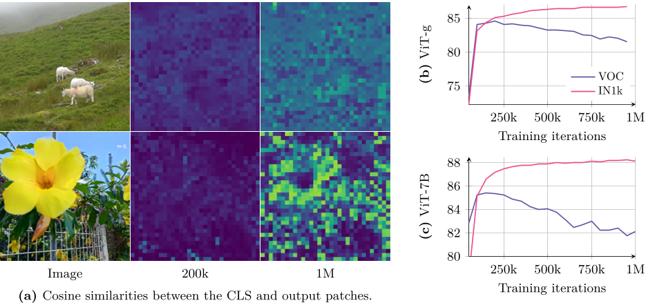
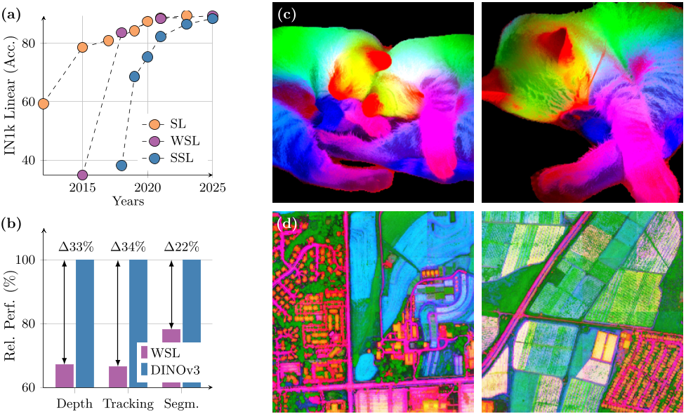
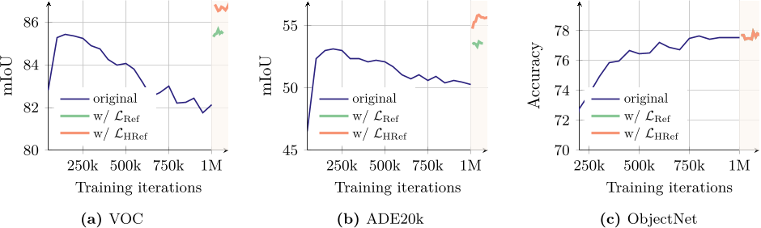
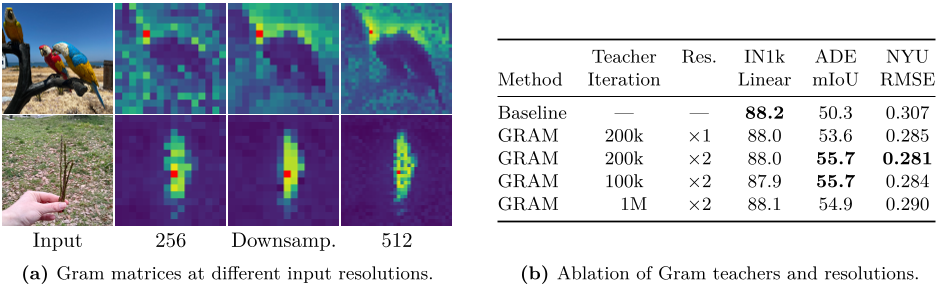
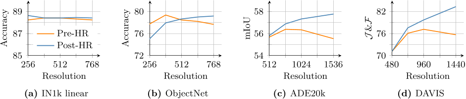
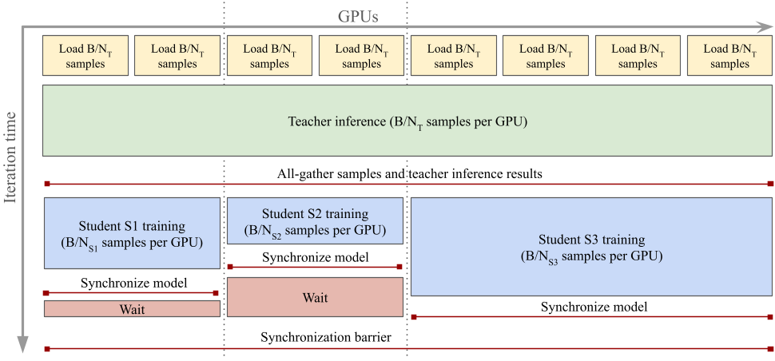
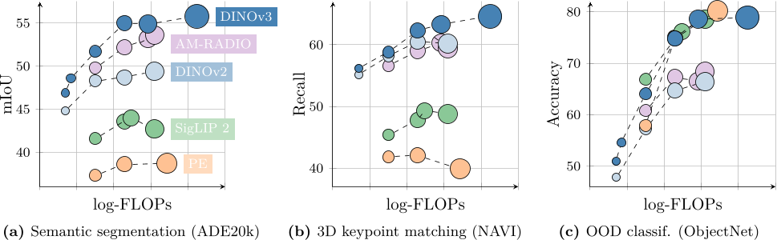

# DINOv3 深度技术解析

## 一句话判断

DINOv3 的核心价值是把一个长期被忽略的矛盾拆开处理。  
模型在长训练中会持续提升全局语义能力，同时逐步损伤局部结构能力。  
DINOv3 用分阶段训练把这两件事解耦，先做强全局，再修复局部，最后完成部署闭环。

---

## 图一 训练后期的核心矛盾

这张图是整篇论文的起点。

- 分类指标继续上升
- dense 指标在后期回落
- cls 与 patch 表示越来越相似

这说明模型后期在向全局语义塌缩。  
全局任务更好，局部判别性变差，分割与对应能力受损。

---

## 图二 方法总览与三阶段流程

论文不是单点技巧，而是完整流程。

- 阶段一 大规模预训练，拉高语义上限
- 阶段二 Gram Anchoring 精炼，修复局部关系退化
- 阶段三 后训练，完成高分辨率适配与多模型蒸馏

这个流程对应三个工程目标。

- 能力上限
- 表示稳定性
- 部署效率

---

## 阶段一 预训练目标与动力学

预训练目标如下。

这个组合的作用分工很清晰。

- DINO 负责全局语义一致性
- iBOT 强化 token 级学习
- DKoleo 提供分布层面的补充约束

长训练能够持续抬升全局表现，但也会放大局部几何退化风险。  
这就是为什么必须引入下一阶段。

---

## 阶段二 Gram Anchoring 的机制

核心思想不是直接对齐特征向量，而是对齐 patch 关系结构。  
关系结构由 Gram 矩阵表达。

student 与 teacher 的优化目标如下。

这种约束方式有两个直接收益。

- 保留局部拓扑关系，恢复 dense 任务
- 不锁死向量值，保留语义继续进化空间

图中可见 dense 指标回升明显，同时全局任务没有被明显拖累。

---

## 图三 高分辨率 teacher 的作用

论文给出的高收益配置是早期快照 teacher 与更高输入分辨率组合。  
实现路径是先高分辨率前向，再下采样到 student 对齐尺度，随后计算关系约束。

这一步提升的本质是让 teacher 提供更细粒度局部结构信号。  
尤其对边界与小目标更敏感的任务，收益更稳定。

---

## 图四 后训练阶段的工程闭环

高分辨率适配负责解决输入尺度变化带来的表示漂移。  
目标是把训练分辨率与部署分辨率之间的能力损失压到更低。

多学生蒸馏负责把一个强教师转成多档学生。  
同一训练周期产出不同延迟与显存预算的可部署模型。  
这一步直接决定方案能否大规模上线。

---

## 结果证据如何读

阅读证据建议按三层。

- 现象层
  先确认问题真实存在，分类上升与 dense 回落并存
- 机制层
  再看 Gram Anchoring 是否精准修复 dense 指标并保持全局能力
- 工程层
  最后看高分辨率适配与蒸馏后是否形成稳定部署收益

如果三层都成立，才能说明这是系统级改进，不是单基准技巧。

---

## 代价与边界

### 计算代价

Gram 关系约束会带来额外计算与显存开销。  
高分辨率 teacher 会进一步提高训练成本。

### 超参敏感性

teacher 快照步数与分辨率倍率会明显影响效果。  
这部分需要严格做消融。

### 任务边界

若业务只关心全局分类，dense 能力并非关键，完整链路的性价比会下降。  
若业务同时依赖分类与分割或对应，收益会明显更高。

---

## 复现与落地清单

### 监控指标

- 全局指标，线性分类与检索
- dense 指标，分割与对应
- 表示指标，cls 与 patch 相似度
- 稳定性指标，不同输入分辨率下性能漂移

### 实施顺序

- 先复现长训练背离现象
- 再加入 Gram Anchoring 做快照步数消融
- 最后叠加高分辨率 teacher 与后训练链路

### 上线策略

- 先产出 small base large 三档蒸馏模型
- 在 dense 敏感业务灰度
- 重点监控边界样本与长尾类别

---

## 最终结论

DINOv3 的贡献不是单纯把模型训更久。  
它把全局增强与局部稳定这两个相互拉扯的目标做了解耦与重组。  
对于需要一个 backbone 同时覆盖分类 dense 与多分辨率部署的团队，这是一条高价值路线。